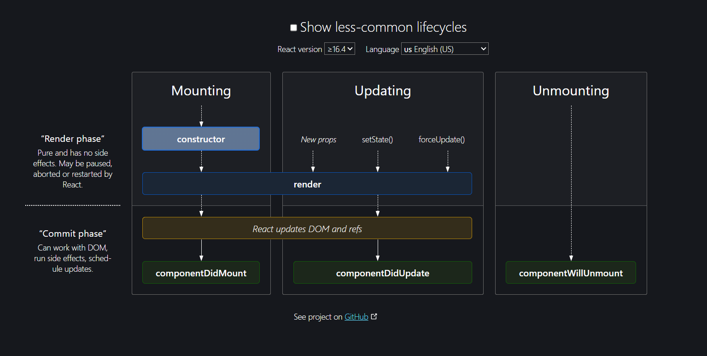
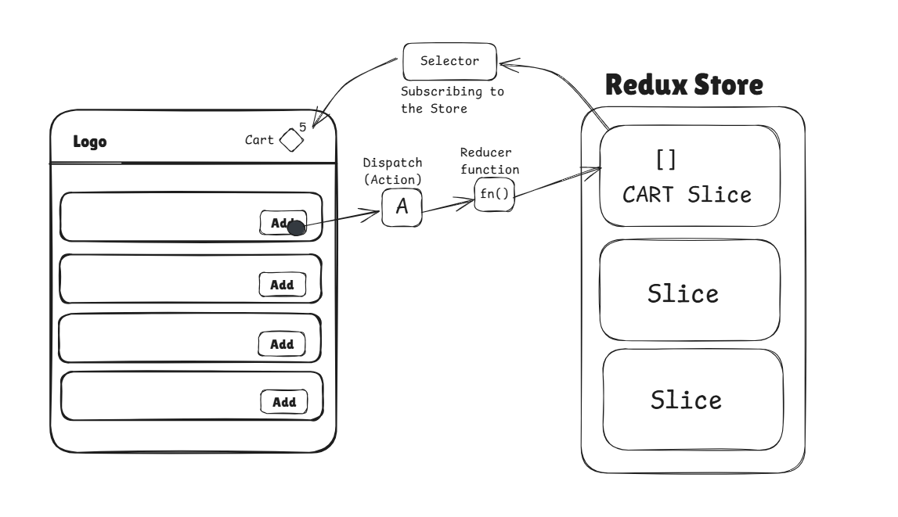

# Namaste-React

## carot ^ (minor version upgrade) and tilde ~ (major version upgrade)

## **<u>Why do we need package-lock.json?</u>**
It keeps track of the exact version of the dependency and creates a hash becoz you might have heard that developers saying the code works fine in local but doesnt work in production its bcz of version missmatch.

## **<u>Transitive dependencies</u>**
 You might have seen that when you install a dependency apart from that there are many files downloaded wit it, this is called Transitive dependency. Eg: If parcel is a dependecy for project and when installed other files are also installed bcz it has its own dependency.

### JSX is nothing but HTML like syntax to write inside JavaScript.

- Babel converts the JSX to --> React.createElement - (JS - object) --> HTML Element
- Attributes should be in camelCase

## <u>React Components</u>
- Class based components
- Functional based component --> A function that returns some JSX / React Element is known as functional component.

## Component Composition
Adding two or more components into one another is known as component composition.

## System Design Interviews
Config driven UI --> Means our UI/website is driven by a config file, where UI changes dynamically with data.

<blockquote style="padding: 10px; border-left: 4px solid #cccc; color:rgb(177, 184, 194)">
  <strong>whenever a state variable changes React re-renders the component.</strong>
</blockquote>


## Virtual DOM
It is the representation of an Actual DOM

## Diffing Algorithm
Finds out the difference between 2 different VDOMs

## Reconciliation Algorithm / React Fiber
Compares React objects OLD vs NEW and updates the DOM

## Why React is fast 
Because React is doing efficient DOM manipulation how? because it uses VDOM (Object representation of HTML). React can efficiently find out the difference between VDOMs and update the UI.

## What is Hooks
Its nothing but a javascript function provided by React based on the usecase.

## When is useEffect() is called
It is instantly called after the component is loaded/rendered on to the page.

## CORS Policy
Accessing the swiggy API from localhost is blocked by CORS policy. 
Who is blocking?
Browsers are blocking us to call API from One origin to another Origin is called CORS policy.

## Shimmer UI
It resembles the actual UI so users will understand how quickly our web app or mobile app load even before the content has shown up.

```jsx
const [btn, setBtn] = useState();
```
### Its a const variable so how its changing?

This line does destructuring. Behind the scenes, it’s like:
```jsx
const stateArray = useState();
const btn = stateArray[0];      // current value of the state
const setBtn = stateArray[1];   // function to update the state
```

React will re-run your component function whenever state changes, and it’ll assign a new value to btn on each render.
- btn is const → its reference won't change during a single render.
- But React re-executes the component function on re-render, so the btn in the next render can hold a different value.
- During re-render, btn now holds "new value" — but it’s still declared as const because it's a new render context
- btn is a const, but it changes because React re-runs the component function and gives btn the new value.
- setBtn is what triggers this re-render.

## What is SPA (Single Page Application)
It is just a one page only components are getting interchanged via client side Routing.

>***Note :*** Server side routing means page reloads, makes a network call gets the response in HTML etc.. and displays in the client side.

## Class based components
Class based components extends React.Component class and it provides a render() method that returns some piece of JSX.
- When using props, props are passed normally to Component but while receiving we have to call super(props) inside the extended Component constructor.
- props are received in constructor and passed in super as super(props) then we can use this.props anywhere in class.

Ex: 
```jsx 
import React from "react";

class UserClass extends React.Component{

    constructor(props){
        super(props);
    }

    render(){
        return (
            <div className="user">
                <h2>Name: {this.props.name}</h2>
                <h3>Contact: abhilash086</h3>
                <h4>Location: Bengaluru</h4>
                <p>Portfolio: Green</p>
            </div>
        )
    }
}

export default UserClass 
```

>### componentDidMount() is called after constructor() and render() is called.
---

## Component Lifecycle Diagram




<h1>Optimising the App</h1>

### Code splitting / Code chunking / Lazy Loading / Dynamic Bundling
---
- Break down the app into multiple small bundles.
- For example now parcel is doing bundling and creates a single JS file to load the app.
- Let us assume there is a Grocery section in which there are 100s of sub components at that time App becomes large and it will take time to Load so instead we create bundle seperately for Grocery section.
- It is loaded when the user clicks on Grocery section so its called Lazy Loading.

## Higher Order Components
It is a function that takes a component and enhances it and return a component.

## Lifting the State Up
Defining the state in Parent component rather than in the Child Component is known as Lifting State.

## Controlled and Uncontrolled Components
- If the components has its own state defined then its called Uncontrolled components.
- If the Components are controlled by the Parent Component then it is called Controlled Component.

## 🔄 Custom Hooks vs Context

| Feature       | Custom Hooks                     | Context                                |
|---------------|----------------------------------|----------------------------------------|
| **Purpose**   | Reuse logic                      | Share state across components          |
| **Shares State?** | ❌ No, each has own state     | ✅ Yes, shared via Provider             |
| **Use Case**  | Encapsulate logic                | Global state (theme, auth, etc)        |

### What does context API solve the problem?
> It eliminate the problem of props drilling.

## Context API
It is a hook provided by React to use the data all over the Application without prop drilling.

# Redux Toolkit
### What is Redux Store
It is nothing but whole big Object where data is stored and is centralised/globalised. Any component in the app can access it.

### What is Slices in Redux Store?
We make the whole apps data into logical seperation which is known as Slices in Redux Store.  
Ex: Cart slice, Authentication Slice etc..

>Note: We cannot directly modify the Cart Slice, we have other way to modify it.

### How to Update the Cart Slice/Slice of Redux Store?
To Update the Cart Slice first we have to dispatch an action which calls a Reducer function and that function will update the Slice of the Redux Store/Cart Slice.

### How do you Read the data from the Slice of Redux Store?
- We will use the Selector which will give us the Data in the component. this phenomenon is known as Subscribing to the Store (Data is in Sync with the Store). 
- Component is subscribed to the store using Selector




